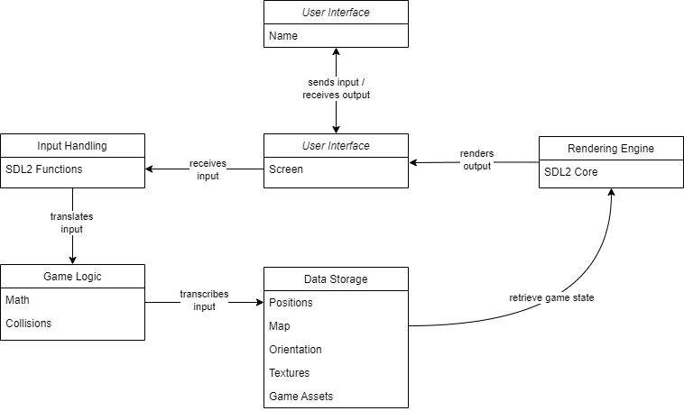
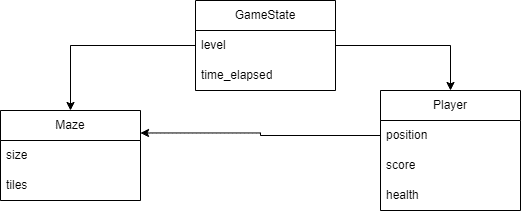
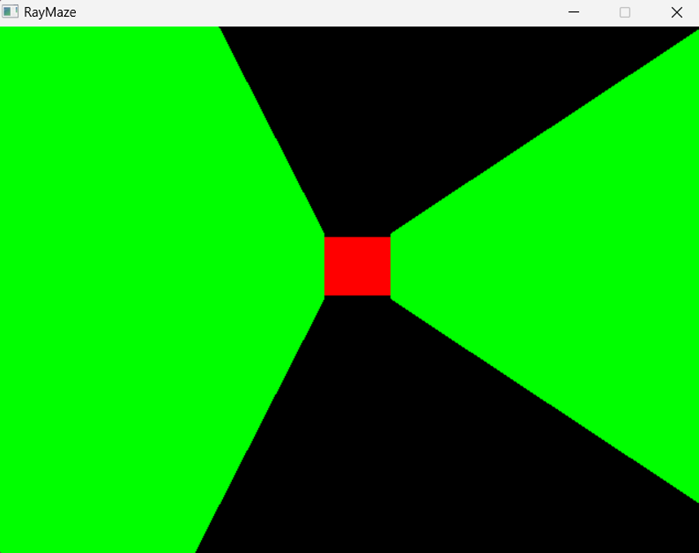

# RayMaze

A journey through the shadows of the maze.

*A 2.5D maze game built using raycasting techniques in C and [SDL2](https://www.libsdl.org/)*.

---

## Table of Contents

1. [Introduction](#introduction)
2. [Inspiration](#inspiration)
3. [Technical Challenges](#technical-challenges)
4. [Project Timeline](#project-timeline)
5. [Features](#features)
6. [Architecture](#architecture)
7. [APIs and Methods](#apis-and-methods)
8. [Data Model](#data-model)
9. [User Stories](#user-stories)
10. [Mockups](#mockups)
11. [Installation](#installation)
12. [Usage](#usage)
13. [Future Iterations](#future-iterations)
14. [Contributing](#contributing)
15. [License](LICENSE)

---

## Introduction

RayMaze is a maze game where the player navigates through a maze to reach the end. The game is built using SDL2 for graphics rendering.
RayMaze is a 2.5D maze game inspired by classic games like DOOM. It leverages raycasting techniques to render a 2.5D environment using the SDL2 library in C. The game challenges players to navigate through a maze, avoiding obstacles and finding the exit.

## Inspiration

The inspiration for RayMaze came from my fascination with early 3D games and the technical challenge of implementing raycasting. I wanted to create a project that not only showcases my skills in C programming and SDL2 but also brings a nostalgic gaming experience to life.

## Technical Challenges

One of the main technical challenges was implementing the raycasting algorithm. Raycasting involves calculating the distance from the player to the walls of the maze to render a 3D perspective. This required a deep understanding of trigonometry and optimization techniques to ensure smooth gameplay.

## Project Timeline

- **Week 1:** Research and project proposal
- **Week 2:** MVP design and initial implementation
- **Week 3:** Development and testing
- **Week 4:** Feature expansion and bug fixes
- **Week 5:** Final testing and deployment
- **Week 6:** Landing page creation and presentation preparation
- **Week 7:** Blog post reflection and GitHub cleanup

## Features

- **3D Rendering:** Real-time 3D rendering using raycasting.
- **Maze Generation:** Procedurally generated mazes for endless gameplay.
- **Obstacle Avoidance:** Dynamic obstacles to increase difficulty.
- **User Interface:** Intuitive UI for easy navigation and gameplay.

## Architecture



The architecture of RayMaze consists of the following components:

- **Game Engine:** Handles the core game logic and rendering.
- **Maze Generator:** Generates the maze layout.
- **Input Handler:** Manages user inputs.
- **Renderer:** Uses SDL2 to render the 3D environment.

## APIs and Methods

### API Routes

- **/api/maze**
  - **GET:** Returns the current maze layout.
  - **POST:** Generates a new maze layout.

### Methods

- **initialize_game():** Initializes the game environment.
- **render_frame():** Renders a single frame of the game.
- **handle_input():** Processes user inputs.

## Data Model



The data model for RayMaze includes:

- **Player:** Stores player position and state.
- **Maze:** Represents the maze layout.
- **Obstacles:** Dynamic obstacles within the maze.

## User Stories

1. **As a player, I want to navigate through a 3D maze so that I can find the exit.**
2. **As a player, I want to avoid obstacles so that I can reach the exit without losing.**
3. **As a developer, I want to generate mazes procedurally so that each game is unique.**

## Mockups

<!--  -->


## Installation

### Prerequisites

- SDL2 library

To install SDL2 run:

```bash
sudo apt-get install libsdl2-dev
```

### Building the Project

1. Clone the repository:

    ```bash
    git clone https://github.com/AyomideA-S/RayMaze.git
    cd RayMaze
    ```

2. Build the project using `make`:

    ```bash
    make
    ```

## Usage

Run the game:

```bash
./bin/RayMaze
```

Alternatively, you can run the Bash script:

```bash
./run.sh
```

- Use the arrow keys to navigate through the maze.
- Avoid obstacles and find the exit to win the game.

## Future Iterations

- **Multiplayer Mode:** Implement a multiplayer mode for competitive gameplay.
- **Enhanced Graphics:** Improve the graphics with textures and lighting effects.
- **Mobile Version:** Develop a mobile version of the game.

## Contributing

Contributions are welcome! Please read the [contributing guidelines](CONTRIBUTING.md) before submitting a pull request.

## License

This project is licensed under the MIT License. See the [LICENSE](LICENSE) file for details.
